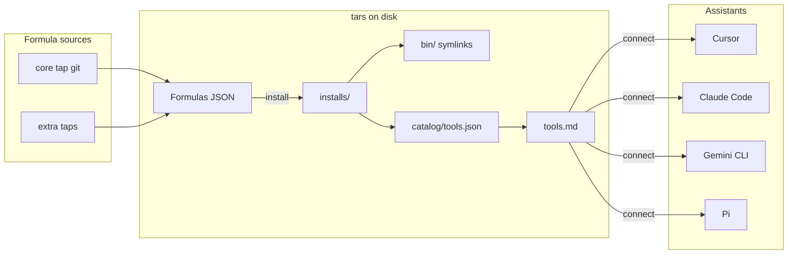

# tars

**tars** is a small package manager for command-line tools, shaped for **coding agents**: it installs verified binaries under `~/.tars`, keeps a machine-readable catalog, and **connects** that inventory to Cursor, Claude Code, Gemini CLI, and Pi so assistants know which CLIs exist and how to use them.

Think of it as the layer between **agents** (models and their runtimes) and **tools** (the binaries on your machine): tars does not run the agent; it installs the tool, records metadata, regenerates `~/.tars/tools.md`, and patches global agent instructions to point at that doc when the task may involve tars-managed CLIs.

## How it fits together



1. **Formulas** (JSON) describe name, version, download URL, `sha256`, binaries, and optional usage text for agents.
2. **`tars install`** downloads the artifact, checks the hash, unpacks under `~/.tars/installs`, symlinks into `~/.tars/bin`, updates `~/.tars/registry.json` and `~/.tars/catalog/tools.json`, refreshes `~/.tars/tools.md`, then runs the same **connect** step as `tars connect` (unless that step fails; you can retry with `tars connect`).
3. **`tars connect`** rebuilds `tools.md` and merges a managed block into global agent files so assistants read `tools.md` when the task may involve those CLIs.
4. Run **`tars link`** once so the **`tars` command is on your PATH** in new terminals (it symlinks into `~/.tars/bin` and updates your shell rc or Windows user PATH). Same directory holds tools from **`tars install`**.

## Install

### Prebuilt binaries (macOS, Linux, Windows)

GitHub’s **Packages** sidebar is only for **registry** packages (npm, Maven, container images, and similar). It does **not** list plain zip/tar installers for macOS, Linux, or Windows. Those files are **release assets** on this repository’s **Releases** page (see [About releases](https://docs.github.com/en/repositories/releasing-projects-on-github/about-releases)): open the repo → **Releases** → choose a version → download the archive for your platform.

Each release includes:

| Platform | Archive (stable URL on *latest* release) |
|----------|------------------------------------------|
| Linux x86_64 | `tars_linux_amd64.tar.gz` |
| Linux arm64 | `tars_linux_arm64.tar.gz` |
| macOS x86_64 | `tars_darwin_amd64.tar.gz` |
| macOS Apple Silicon | `tars_darwin_arm64.tar.gz` |
| Windows x86_64 | `tars_windows_amd64.zip` |
| Windows arm64 | `tars_windows_arm64.zip` |

Versioned filenames (e.g. `tars_v0.0.1_linux_amd64.tar.gz`) and `checksums.txt` are on the same release page.

**Direct download** for the *current* latest release (replace `OWNER` and `REPO`):

```text
https://github.com/OWNER/REPO/releases/latest/download/tars_linux_amd64.tar.gz
https://github.com/OWNER/REPO/releases/latest/download/tars_darwin_arm64.tar.gz
https://github.com/OWNER/REPO/releases/latest/download/tars_windows_amd64.zip
```

Extract the binary, run **`tars link`**, open a **new** terminal (or `source` your rc file), then run `tars connect` if you use agent integration.

**macOS (“can’t be opened because Apple cannot check it for malicious software”):** Release builds are not Apple-notarized. After extracting, clear the download quarantine and run again:

```bash
xattr -dr com.apple.quarantine /path/to/tars
```

Or in Finder: **Control-click** `tars` → **Open** once, or use **System Settings → Privacy & Security → Open Anyway** after a blocked launch.

**Release cadence:** each push to **`main`** (including merged PRs) runs **Tag version on main**, which finds the highest existing `vMAJOR.MINOR.PATCH` tag, bumps the **patch** (`v1.2.3` → `v1.2.4`), pushes that tag, then in the **same** workflow run builds binaries and publishes the GitHub Release (GitHub does not run a separate workflow for tag pushes made with the default `GITHUB_TOKEN`). Pushing a **`v*`** tag yourself triggers that same workflow and performs the build and release for that tag. If `main`’s tip commit **already** has a tag, the auto-tagger does nothing so you don’t double-tag the same commit.

### Build from source (Go 1.22+)

```bash
go build -o tars ./cmd/tars
```

Embed a version string (optional):

```bash
go build -ldflags="-X tars/internal/version.Version=v0.1.0" -o tars ./cmd/tars
```

## Global flags and help

| Flag | Description |
|------|-------------|
| `-h`, `--help` | Help for `tars` or any subcommand (e.g. `tars install --help`). |
| `-v`, `--version` | Print the tars version (`dev` when built without `-ldflags`). |

The `help` subcommand is the same as `--help` (e.g. `tars help connect`).

## Commands

### `tars install <formula>`

Download, verify SHA256, install under `~/.tars`, link binaries, update registry and catalog, refresh `tools.md`, and apply **connect** to agent globals.

The argument is a formula **name** (resolved from core + tapped repos) or a path to a formula JSON file.

### `tars uninstall <name>`

Remove an installed tool (prefix, symlinks, registry entry, catalog entry), refresh `tools.md`, and run **connect**.

### `tars link`

Install **`tars` on your command-line PATH** for future shells: symlinks this binary to `~/.tars/bin`, then prepends `~/.tars/bin` to PATH by editing `~/.zshrc`, `~/.bashrc` / `~/.bash_profile`, or Fish’s `config.fish` (from `$SHELL`), or the **Windows user PATH** in PowerShell. Safe to run again (skips if already set up). For the **current** POSIX shell it also prints `export PATH=…` to copy-paste.

### `tars list`

List installed tools (name, version, tap).

- **`tars list --available`** (`-a`): list formula names available from taps instead.

### `tars info <name>`

If the name is installed, print install paths and checksum info. Otherwise show the formula JSON from taps.

### `tars update`

Fetch the latest formula definitions for the core repo and any user taps (`git pull`-style workflow).

### `tars tap add <name> <git-url>`

Clone an additional formula repository under `~/.tars/taps/<name>`.

### `tars tap list`

Print registered taps (including core), tab-separated name and URL.

### `tars connect`

Regenerate `~/.tars/tools.md` and merge a managed `<!-- tars-connect -->` block into:

- `~/.cursor/rules/tars-tools.mdc` (Cursor, `alwaysApply`)
- `~/.claude/CLAUDE.md`
- `~/.gemini/GEMINI.md`
- `~/.pi/agent/AGENTS.md`

**Flags:**

| Flag | Description |
|------|-------------|
| `--copy <dir>` | Copy `tools.md` into `<dir>/tools.md` (e.g. project root). |
| `--no-cursor` | Skip Cursor rule. |
| `--no-claude` | Skip Claude global. |
| `--no-gemini` | Skip Gemini global. |
| `--no-pi` | Skip Pi global. |

### `tars catalog`

Print the absolute path to `~/.tars/catalog/tools.json` (merged model-facing index). The file may not exist until you install at least one tool.

### `tars hash <file>`

Print the SHA256 of a file (for filling formula `sha256` fields).

### `tars publish validate <formula.json>`

Validate a formula file (including required security fields such as `sha256`).

### `tars publish init <name>`

Write a template `<name>.json` in the current directory for a new formula.

### `tars completion <shell>`

Generate shell completion scripts (see `tars completion --help`).

## Environment

| Variable | Description |
|----------|-------------|
| `TARS_CORE_URL` | Git remote URL for the core formula repo (default: `https://github.com/tars/homebrew-core.git`). Set to `none` or `-` to disable the core tap. |

## Layout under `~/.tars`

| Path | Role |
|------|------|
| `bin/` | Symlinks to installed executables (add to PATH). |
| `installs/<name>/<version>/` | Versioned install trees. |
| `taps/core/` | Clone of the core formulas repo. |
| `taps/<tap>/` | Extra taps from `tars tap add`. |
| `cache/downloads/` | Download cache. |
| `registry.json` | Installed-tool registry. |
| `catalog/tools.json` | Merged catalog for tools/models. |
| `tools.md` | Human-readable list and usage for agents (source of truth for **connect**). |
